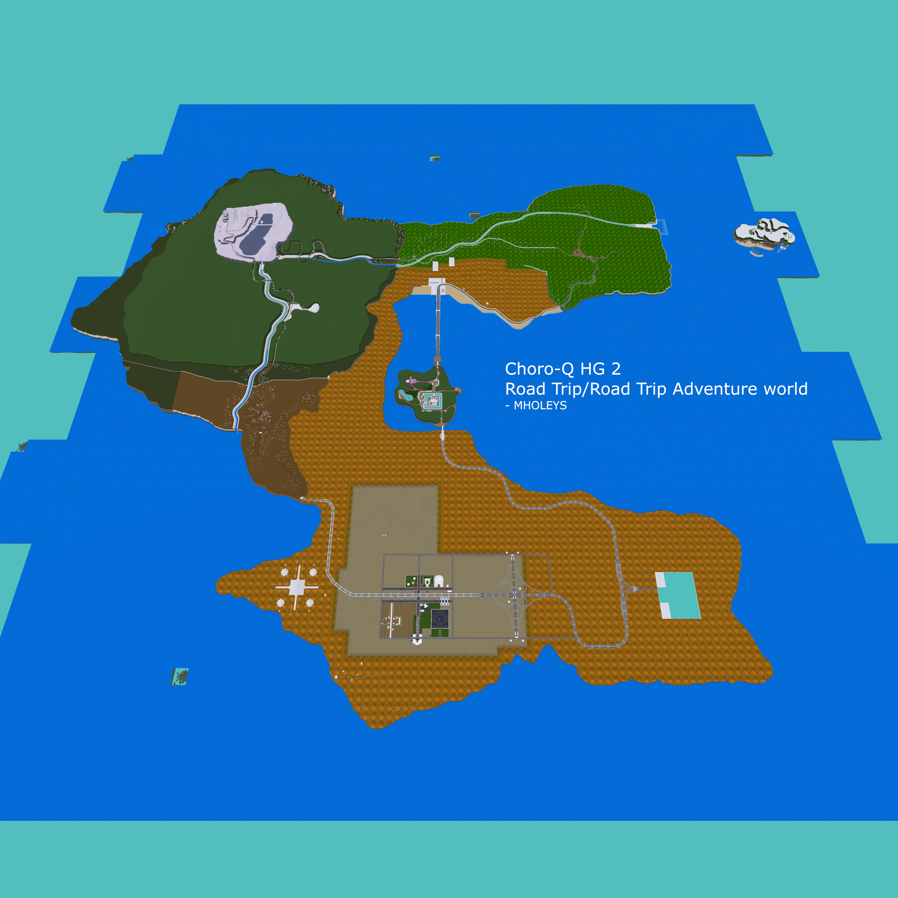
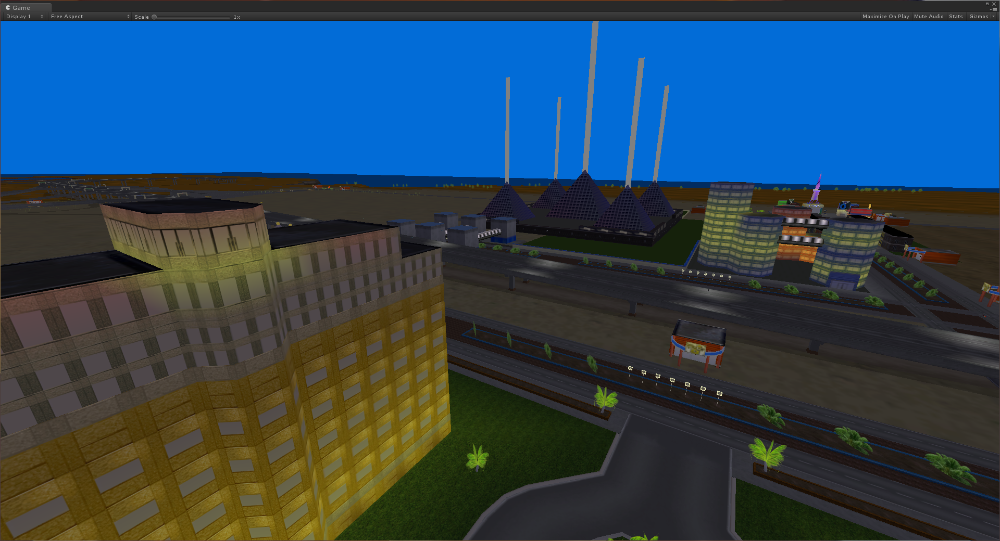

# Road Trip Adventure / ChoroQ HG 2 / チョロQ HG 2 extraction tools

This is a set of tools used to extract the data from the PS2 game Road Trip Adventure (UK/EU) / Everywhere Road Trip (US) / ChoroQ HG 2 (JP) チョロQ HG 2 - written in python.

There has also been work on HG 3, but this is very much WIP, this game is also known as Gadget Racers or ChoroQ HG 3, made by e-Game. 

This has been tested with only the EU/UK version of the game, as this is the one I have. I have not really tested this with other games in the ChoroQ series, but after a quick look the files seem very different between games. It should also work with the US/American version, and the JP/Japanese & KR/Korean version, as the text is the main difference.

Originally only wanted to create a tool to extract the car models, and textures, but the other files for the game are very similar and some data can be extracted from them as well. Building on my understanding of the car file format I have expanded this to work with the other files, most of the data on the disc is loaded directly to GS/VU1 via DMA transfers. 

#### Features
Currently, it is possible to get all field (FLD/xxx.BIN), course (COURSE/Cxx.BIN), action (ACTION/Axx.BIN), and car models (CAR{0,1,2,3,4,S}/Qxx.BIN).
The field/course file format are not fully understood, but the model, and most of the textures can be extracted (if a texture fails to be understood the rest of the textures usually fail). It is possible to get the mini-map model, and some level extras such as doors/barrels. 
Textures should map to the correct mesh, which is setup via GIF tags in the .BIN files.

Working (HG 2):
- Car models/textures
- Main world (FLD/field), with textures and optional vertex colours
- Race Courses (COURSE), with textures and optional vertex colours
- Mini-games (ACTION), with textures and optional vertex colours

Working (HG 3):
- Car models/textures
- Race Courses (COURSE), with textures

Documentation of the file formats below are still being worked on, and the best source of info is within the code.
(Code is messy as it evolves, sorry)
- For field/course/action files see the choroq/course.py
- For car files see the choroq/car.py file
- For textures see the choroq/texture.py file
- For Sys/Shop/Item see above + choroq-extractor.py

##### Course/Field/Action file format
The information here was previously different, this was before I had realised that most of the data uses **DMA/GIF** and **VIF tags/codes** to directly load data from the disc to be drawn with little overhead. After this discovery (perhaps this should have been more obvious earlier), I have realised that the other files on the disc like the SYS/ files also use these DMA/VIF/GIF tags to basically load all data as is, with only minimal checks done by the CPU.

The course/field/action files contain multiple sub-files:
- Textures
  - This is all the textures that the field/course use, and are just one after each other
  - **Not all texture formats are understood**, so some may turn out wrong, or will cause other textures to be skipped
  - Each texture is prefixed with DMA tags (16bytes) with the length of the transfer, along with GIF tags to setup transfer parameters (PACKED mode, destination/size/format) and transfer the image data (IMAGE mode)
- Chunks
  - This is the level data, which holds all the details on each of the meshes within each chunk of the course/field
  - At the start of data there is a list of offsets (4 bytes)
    - This list is, usually, 8x8 chunks with an extra offset, which holds meshes spread across the whole region, such as trees (referred to as "extra" chunk)
  - After the list of chunk offsets, there is a list of shorts (2 bytes) which holds the number of (I think) GIF tags in each chunk
    - After this 8x8 list of counts, there is another short, holding the size for the "extra" chunk
    - If anyone wants to replicate this decoding with another method, I would recommend grouping meshes by the addresses that they reference, without this there will be a huge number of meshes produced/rendered, which can significantly be reduced by merging across chunks. 
  - The extra chunk can hold:
    - The water mesh (top layer) for rivers
    - Windows for fields (which may switch between two, to light up at night/day)
    - And billboards, which use a slightly modified layout for the mesh structure, with x/y/z starting points before the usual format (this is done via another GIF tag)
  - The data within each chunk is built up of DMA tags, VIF tags (used to expand the data into xyz+w where w is not really used, and is often 0) and GIF tags
    - Some of the GIF tags configure which textures (via addresses) are used in the mesh
    - DMA tags are 8 bytes as the additional bytes are used for VIF tags
    - GIF tag difference:
      - The GIF tags are not used by the GS directly in the game, the data is transferred to the GS, but a VU1 program manipulates the data into the data as the GS would expect, due to this the data is in easy to decode floats (4 bytes)
      - The ones I have come across are a GIF tag with the following registers ST RGBAQ and XYZ(F)(2/3)
      - For fields the data is usually in the format of X/Y/Z, Daytime R/G/B colours, texture coordinates, and Night R/G/B colours
      - The structure of the data after the GIF tag depends mostly on the VIF tag with MSCALF EXECADDR, where EXECADDR selects a different part of the VU1 program to run, which changes how the data is rendered. I have not decoded this VU1 code
- Possibly a collision mesh, as is usually just the roads for courses/actions, but covers everything in the fields
  - The course files seem to only use this to hold a copy of the road
  - The field files seem to use this section for most of the level in lower detail
  - I believe after playing with the meshes more, that this is used as an allowed boundary.
    I would guess the cars check if they are on the mesh (probably 4 corners), to detect collisions into walls and other solid objects. 
  - There are properties set within this data, such as an underwater or water parameter, and friction, these values are not yet understood fully
  - The format of this is similar to the mesh/model data but the chunk size is halved (16x16 chunks for each region)
    - This also has the size/count table, but it is 16x16
    - There are no DMA or VIF tags, but instead there is a GIF or very similar tag
- Overlay map, or number of extra meshes such as doors/barrels
  - The end of the file contains a mini-map of the roads, (not all actions have a map)
  - There may also be other models after the 3rd offset, which are usually spawned for different reasons
    - Examples:
      - Peach that falls from the peach tree in Field 223 (Peach town)
      - Stage cover in Fuji city (hiding the princess)
      - Treasure chest parts in the maze action

For HG3 files, there are some differences, key differences are that the size of the chunk array is often 16x16 for meshes, and 32x32 for collider, and that other functions of the GS/VIF are used. The exec addresses are different as the VU1 code is different between the games.

##### Car model file format
The car file format is the most understood, and it is possible to get the car body model, texture, as well as its accessories.
Sub-File structure (HG2):
- 0 Car body
- 1 Lights (front/back) probably used for night driving lights
- 2 Rear Lights, probably used for brake lights
- 3 Car body (low poly/reduced detail)
- 4 Lights (front/back) probably used at night for cars far away with lower detail car
- 5 Rear Spoiler 1
- 6 Rear Spoiler 2
- 7 Rockets (optional), used to change where the rocket model connects to the car
- 8 Sticker area model, not all cars have stickers

The car file format uses a similar system to the Field/Course/Action meshes, it uses DMA/VIF/GIF tags, and has different EXECADDRes (so a different VU1 program executes)

### Extracting car models

Requires Python 3.7+
Requires Pillow (PIL) and colorama python libs

See the car-extractor.py file:
``` python car-extractor.py <input folder> <output folder> [type]```

e.g to make PLY files from the `CAR0` folder

``` python car-extractor.py CAR0 ~/cars 2```

e.g to make both OBJ and PLY files from the `CAR0` folder

``` python car-extractor.py CAR0 ~/cars```

e.g to make OBJ files from the Q00.BIN car (single car mode)

``` python car-extractor.py Q00.BIN ~/cars 1```

If you would like the vertex colours, PLY is the better choice, but you can also now use 'C' as the format option, which now adds colours to the OBJ format, however this is not universally supported. 

### Extracting Fields/Courses:
See the choroq-extractor.py file for additional details:
Basic usage (help can be printed with no arguments)
``` python choroq-extractor.py <input folder> <output folder> [type]```

``` python choroq-extractor.py E:/ ~/road-trip/ ```

e.g to make OBJ files from road trip disc
This will attempt to group all meshes within a field/course/action by their used texture, this reduces the number of files produced and saves on draw calls. This does however break the chunk based system the game uses, but this should be fine for most purposes.

``` python choroq-extractor.py E:/ C:/road-trip/ 1```

e.g to make PLY files from road trip disc, this mode has been neglected in the last few changes, so you may be better using the OBJ format

**PLY format for course/field/action is currently not working, this may not get fixed**

``` python choroq-extractor.py E:/ C:/road-trip/ 2```

#### Demo




#### Information sources:

- Most key mesh information was found https://forum.xentax.com/viewtopic.php?t=17567 (website closed)
- More information about the textures were extracted from https://zenhax.com/viewtopic.php?t=7405 (website closed)
  - https://web.archive.org/web/20220309142950/https://zenhax.com/viewtopic.php?t=7405
- Some code is based on the BMS/3DS Max script in the forum above (note: forum has been closed)
- Other information was gathered from analysis or PlayStation/2 memory/data formats found in the manuals, useful for how the TIM file and palette data is stored, although this game does not use TIM files or other storage files
- Not yet used but could be useful https://btest4he.com/cheat_code/index.html

#### Thanks:
- killercracker (3DS max script)
- Acewell (BMS script)
- e-Game (JP) for making a very interesting game that I and many others have spent many hours playing

#### Other notes:
- I do not claim ownership of any content of the PS2 games, I have created this with the plan of understanding how the game works. Anyone who uses this takes responsibility for how they use the produced output.
- If you end up using my tool to produce something cool, please link to this github page so people can explore the game, also LMK how you use it
- If you have any issues with the tool, check the issues at the top, things should be improving as I understand more